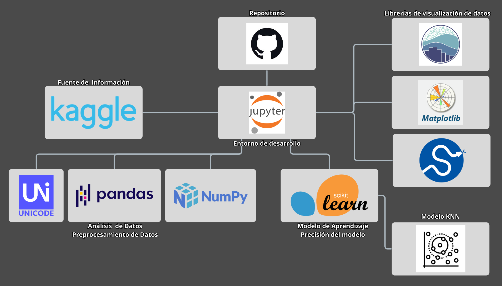
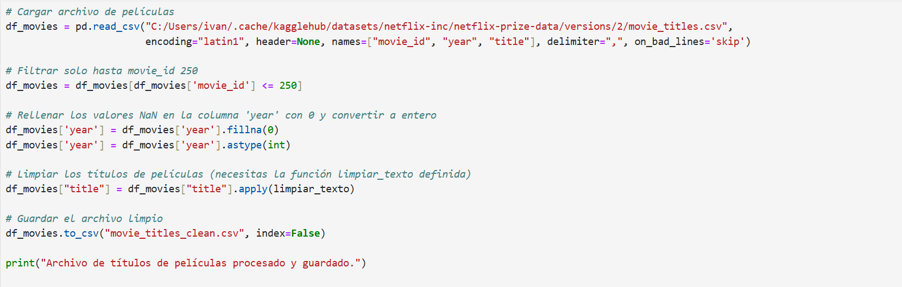

# MovIA

* Algoritmo de recomendación de películas basado en gustos similares.

## Tabla de contenidos
1. [Descripción](#Descripción)
2. [Arquitectura](#Arquitectura)
3. [Proceso](#Proceso)
4. [Estado del proyecto](#EstadoDelProyecto)
5. [Conclusion](#Conclusion)

# Descripción
Este proyecto consiste en un sistema de recomendación de películas que sugiere opciones a los usuarios en función de sus preferencias y las de otros con gustos similares.

# Arquitectura
* Arquitectura del proyecto + imagen

# Proceso
Proceso de desarrollo:

- Fuente del dataset
https://www.kaggle.com/datasets/netflix-inc/netflix-prize-data/data

- Limpieza de datos

- Estadísticos (Valores, gráficos, …)

# EstadoDelProyecto
El sistema de recomendación está funcional y ofrece sugerencias de películas basadas en las preferencias de los usuarios. Aunque se han identificado posibles mejoras en la precisión y optimización del modelo, por el momento no se tiene previsto implementarlas. Además, se ha considerado la posible implementación de un sitio web donde los usuarios puedan ingresar su ID y recibir sus recomendaciones de manera personalizada.

# Conclusion
El sistema de recomendación desarrollado permite ofrecer sugerencias de películas basadas en las preferencias de los usuarios, proporcionando una experiencia única y personalizada. Aunque el modelo es funcional y cumple su propósito, existen oportunidades de mejora en la precisión de las recomendaciones y la optimización del algoritmo.
